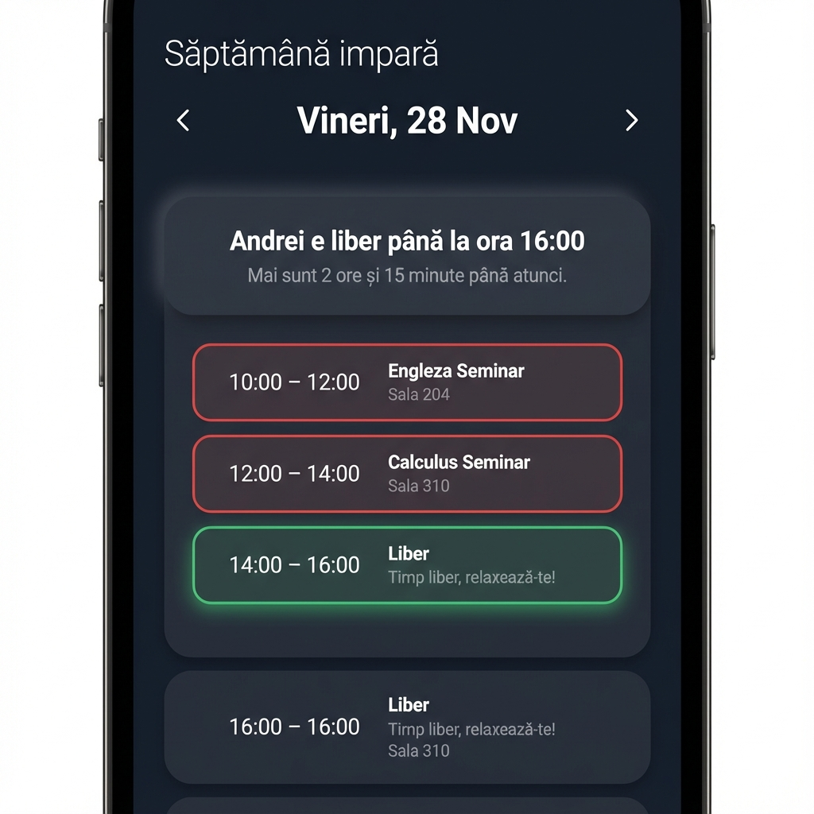

# IamBusy 📅


**IamBusy** is a sleek, mobile-first web application designed to keep your university schedule organized and accessible. It automatically detects odd/even weeks, displays your daily timeline, and provides real-time status updates so you (and others) know exactly when you're free.



## ✨ Features

-   **Smart Scheduling**: Automatically toggles between Odd and Even week schedules based on a configurable academic start date.
-   **Real-Time Status**: Instantly see if you are currently in a course or on a break, with a precise countdown to the next event.
-   **Live Clock**: A prominent clock that updates every second — no need to refresh.
-   **Day Navigation**: Seamlessly switch between days using **Previous/Next arrows**, or jump to any specific date via the **Calendar Date Picker**.
-   **Visual Timeline**: A modern dark-mode interface with glassmorphism cards, accent borders, and micro-animations.
-   **Mobile Optimized**: Designed to look and feel like a native app on your phone.

## 🏗️ Architecture

```
iambusy/
├── app.py                    # Flask HTTP layer (thin controller)
├── schedule_engine.py        # Business logic (week parity, timeline, status)
├── schedule_config.py        # Your schedule data (user-editable)
├── schedule_config.example.py
├── static/
│   ├── style.css             # Design system (tokens, components, animations)
│   └── schedule.js           # Live clock, auto-scroll, date picker
├── templates/
│   └── index.html            # Jinja2 template (semantic HTML5)
├── tests/
│   └── test_schedule_engine.py  # 30 unit tests
├── .gitignore                # Excludes .venv, .pytest_cache, tests/
├── requirements.txt
└── README.md
```

> **Note:** `.venv/`, `.pytest_cache/`, `__pycache__/`, `tests/`, and `.DS_Store` are excluded from version control via `.gitignore`.

## 🚀 Getting Started

### Prerequisites

-   Python 3.9 or higher

### Installation

1.  **Clone the repository**
    ```bash
    git clone https://github.com/andreinita21/IamBusy.git
    cd IamBusy
    ```

2.  **Create a virtual environment & install dependencies**
    ```bash
    python3 -m venv .venv
    source .venv/bin/activate
    pip install -r requirements.txt
    ```

3.  **Configure your schedule**
    Copy the example config and edit it with your courses:
    ```bash
    cp schedule_config.example.py schedule_config.py
    ```
    Then edit `schedule_config.py` — set your name, academic start date, and fill in your weekly schedule.

### Running the App

```bash
source .venv/bin/activate
python app.py
```

Open your browser at: `http://localhost:2026`

### Running Tests

```bash
python -m pytest tests/ -v
```

## 🛠️ Configuration

Edit `schedule_config.py` to define your schedule:

```python
USER_NAME = "Your Name"
ACADEMIC_WEEK1_START = date(2025, 10, 29)

SCHEDULE_ODD = {
    'Luni': [
        ("Course Name (Type) | Room", "08:00", "10:00"),
    ],
    # ... other days
}
```

## 📦 Tech Stack

-   **Backend**: Flask (Python)
-   **Frontend**: HTML5, CSS3 (Custom Design System), JavaScript
-   **Templating**: Jinja2
-   **Testing**: pytest

## 📄 License

This project is licensed under the MIT License - see the [LICENSE](LICENSE) file for details.
