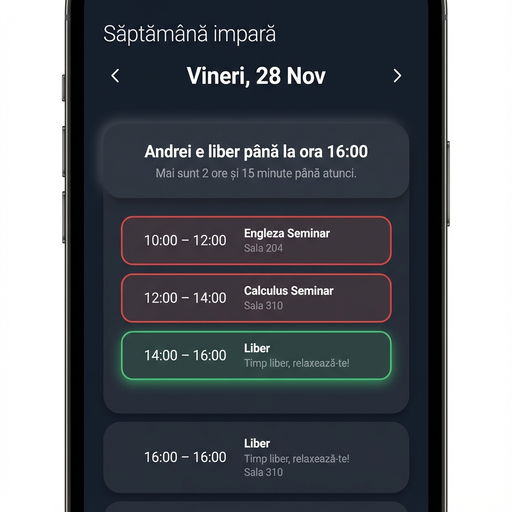

# IamBusy 📅


**IamBusy** is a sleek, mobile-first web application designed to keep your university schedule organized and accessible. It automatically detects odd/even weeks, displays your daily timeline, and provides real-time status updates so you (and others) know exactly when you're free.



## ✨ Features

-   **Smart Scheduling**: Automatically toggles between Odd and Even week schedules based on a configurable academic start date.
-   **Real-Time Status**: Instantly see if you are currently in a course or on a break, with a precise countdown to the next event.
-   **Live Clock**: A prominent clock that updates every second — no need to refresh.
-   **Day Navigation**: Switch days with **Previous/Next arrows**, the **week strip**, keyboard (`←` `→` `T` `C`) or swipe.
-   **Month Calendar with Busy Bars**: A custom date picker where every day shows a tiny 07:00–22:00 bar of its courses (colour-coded by type) and the academic week number. Tap a day to preview its full timeline and free windows *before* you commit to it, then open it or jump straight to "schedule something here".
-   **Free Windows at a Glance**: Each day lists its gaps between courses, and every gap has an **Adaugă** shortcut that opens the editor pre-filled with that day, week parity and time slot.
-   **Neobrutalist UI**: Thick borders, hard offset shadows, flat saturated colour and heavy type. Dark theme by default, light theme one click away (remembered per device).
-   **Mobile Optimized**: Bottom-sheet calendar, swipe navigation and a horizontally scrollable weekly grid.

### 🗓️ Schedule Management

A full-featured management page (`/manage`) lets you take control of your schedule:

-   **Weekly Grid View**: See all your activities laid out on a 7-day × 15-hour grid, with separate tabs for Odd and Even weeks.
-   **Add Activities**: Click any empty cell or use the **+** button to add a new activity with a name, day, time, and week type.
-   **Edit Activities**: Click on any existing activity card to edit its details.
-   **Drag & Drop**: Grab any activity card and drag it to a new time slot or day — duration is preserved automatically.
-   **Delete Activities**: Remove activities with a single click and confirmation dialog.
-   **Conflict Detection**: When adding or moving an activity into an occupied time slot, a warning dialog shows the conflicting activities and gives you two options:
    -   **Delete the conflicting activity** and proceed with the save.
    -   **Choose another time** and go back to the form.
-   **Smart Defaults**: Setting a start time automatically sets the end time to +2 hours.
-   **Persistent Storage**: All changes are saved to a local SQLite database, seeded from your `schedule_config.py` on first run.

## 🏗️ Architecture

```
iambusy/
├── app.py                    # Flask HTTP layer + REST API
├── db.py                     # SQLite database layer (CRUD + conflict detection)
├── schedule_engine.py        # Business logic (week parity, timeline, status)
├── schedule_config.py        # Your schedule data (user-editable, seeds DB on first run)
├── schedule_config.example.py
├── static/
│   ├── style.css             # Neobrutalist design system (tokens, components)
│   ├── schedule.js           # Live clock, month calendar, navigation, theme
│   └── manage.js             # Schedule management UI (grid, drag & drop, modals)
├── templates/
│   ├── index.html            # Daily schedule view
│   └── manage.html           # Schedule management page
├── .gitignore
├── requirements.txt
└── README.md
```

> **Note:** `schedule.db`, `.venv/`, `__pycache__/`, and `.DS_Store` are excluded from version control via `.gitignore`.

## 🚀 Getting Started

### Prerequisites

-   Python 3.9 or higher

### Installation

1.  **Clone the repository**
    ```bash
    git clone https://github.com/andreinita21/iambusy.git
    cd iambusy
    ```

2.  **Create a virtual environment & install dependencies**
    ```bash
    python3 -m venv .venv
    source .venv/bin/activate
    pip install -r requirements.txt
    ```

3.  **Configure your schedule**
    Copy the example config and edit it with your courses:
    ```bash
    cp schedule_config.example.py schedule_config.py
    ```
    Then edit `schedule_config.py` — set your name, academic start date, and fill in your weekly schedule.

### Running the App

```bash
source .venv/bin/activate
python app.py
```

Open your browser at: `http://localhost:2026`

To manage your schedule, click **⚙️ Manage Schedule** in the footer or go directly to `http://localhost:2026/manage`.

### API Endpoints

| Method   | Path                     | Description                        |
|----------|--------------------------|------------------------------------|
| `GET`    | `/api/activities`        | List all activities (JSON)         |
| `POST`   | `/api/activities`        | Add a new activity                 |
| `PUT`    | `/api/activities/<id>`   | Update / move an activity          |
| `DELETE` | `/api/activities/<id>`   | Delete an activity                 |
| `POST`   | `/api/conflicts`         | Check for time conflicts           |
| `GET`    | `/api/days?from=&to=`    | Per-day summaries (max 62 days) for the month calendar |

## 🛠️ Configuration

Edit `schedule_config.py` to define your schedule:

```python
USER_NAME = "Your Name"
ACADEMIC_WEEK1_START = date(2025, 10, 29)

SCHEDULE_ODD = {
    'Luni': [
        ("Course Name (Type) | Room", "08:00", "10:00"),
    ],
    # ... other days
}
```

On the first run, the app seeds a SQLite database from this config. After that, all changes are made through the `/manage` UI and persisted in `schedule.db`.

New semester? Update `schedule_config.py` (schedule + `ACADEMIC_WEEK1_START`) and replace the DB contents with:

```bash
python3 db.py --reseed
```

## 📦 Tech Stack

-   **Backend**: Flask (Python)
-   **Database**: SQLite (via `db.py`)
-   **Frontend**: HTML5, CSS3 (Custom Design System), JavaScript
-   **Templating**: Jinja2

## 📄 License

This project is licensed under the MIT License - see the [LICENSE](LICENSE) file for details.
