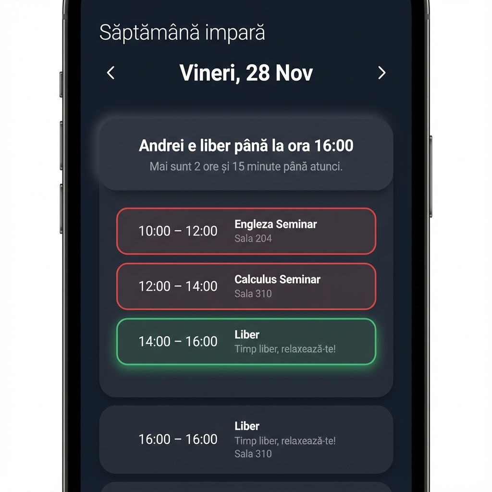

# IamBusy 📅


**IamBusy** is a sleek, mobile-first web application designed to keep your university schedule organized and accessible. It automatically detects odd/even weeks, displays your daily timeline, and provides real-time status updates so you (and others) know exactly when you're free.



## ✨ Features

-   **Smart Scheduling**: Automatically toggles between Odd and Even week schedules based on a configurable academic start date.
-   **Real-Time Status**: Instantly see if you are currently in a course or on a break, with a precise countdown to the next event.
-   **Live Clock**: A prominent clock that updates every second — no need to refresh.
-   **Day Navigation**: Switch days with **Previous/Next arrows**, the **week strip**, keyboard (`←` `→` `T` `C`) or swipe.
-   **Month Calendar with Busy Bars**: A custom date picker where every day shows a tiny 07:00–22:00 bar of its courses (colour-coded by type) and the academic week number. Tap a day to preview its full timeline and free windows *before* you commit to it, then open it or jump straight to "schedule something here".
-   **Free Windows at a Glance**: Each day lists its gaps between courses, and every gap has an **Adaugă** shortcut that opens the editor pre-filled with that day, week parity and time slot.
-   **Neobrutalist UI**: Thick borders, hard offset shadows, flat saturated colour and heavy type. Dark theme by default, light theme one click away (remembered per device).
-   **Mobile Optimized**: Bottom-sheet calendar, swipe navigation and a horizontally scrollable weekly grid.

### 🗓️ Schedule Management

A full-featured management page (`/manage`) lets you take control of your schedule:

-   **Weekly Grid View**: See all your activities laid out on a 7-day × 15-hour grid, with separate tabs for Odd and Even weeks.
-   **Add Activities**: Click any empty cell or use the **+** button to add a new activity with a name, day, time, and week type.
-   **Edit Activities**: Click on any existing activity card to edit its details.
-   **Drag & Drop**: Grab any activity card and drag it to a new time slot or day — duration is preserved automatically.
-   **Delete Activities**: Remove activities with a single click and confirmation dialog.
-   **Conflict Detection**: When adding or moving an activity into an occupied time slot, a warning dialog shows the conflicting activities and gives you two options:
    -   **Delete the conflicting activity** and proceed with the save.
    -   **Choose another time** and go back to the form.
-   **Smart Defaults**: Setting a start time automatically sets the end time to +2 hours.
-   **Persistent Storage**: All changes are saved to a local SQLite database (`schedule.db`).

## 🏗️ Architecture

```
iambusy/
├── app.py                    # Flask HTTP layer + REST API
├── db.py                     # SQLite database layer (CRUD + conflict detection)
├── schedule_engine.py        # Business logic (week parity, timeline, status)
├── setup.sh                  # One-command install / config / systemd service
├── schedule_config.example.py # Blank config template
├── schedule_config.py        # Your settings (created by setup.sh, not in git)
├── static/
│   ├── style.css             # Neobrutalist design system (tokens, components)
│   ├── schedule.js           # Live clock, month calendar, navigation, theme
│   └── manage.js             # Schedule management UI (grid, drag & drop, modals)
├── templates/
│   ├── index.html            # Daily schedule view
│   └── manage.html           # Schedule management page
├── .gitignore
├── requirements.txt
└── README.md
```

> **Note:** `schedule_config.py`, `schedule.db`, `.venv/`, `__pycache__/`, and `.DS_Store` are excluded from version control via `.gitignore`.

## 🚀 Getting Started

You need Python 3.9+ (on Debian/Ubuntu also `sudo apt install python3-venv`).

### Quick start

```bash
git clone https://github.com/andreinita21/iambusy.git
cd iambusy
./setup.sh
```

`setup.sh` asks for your name, the first day of week 1 and a port, then:

1.  creates a virtualenv in `.venv/` and installs the dependencies,
2.  writes `schedule_config.py` with a **blank schedule**,
3.  creates the empty SQLite database (`schedule.db`).

Start the app with the command it prints:

```bash
.venv/bin/gunicorn --bind 0.0.0.0:2026 app:app
```

Open `http://localhost:2026` and build your schedule from scratch in **`/manage`** — click any empty cell to add an activity.

### Hosting (keep it running)

```bash
./setup.sh --service
```

This asks for your sudo password and installs a systemd service (`iambusy.service`) that starts at boot and restarts automatically if the app ever dies. If a unit with that name already exists, the script asks before replacing it and keeps a `.bak` copy.

```bash
systemctl status iambusy        # is it running?
journalctl -u iambusy -f        # live logs
sudo systemctl restart iambusy  # after changing schedule_config.py or updating
```

The app has **no login**: anyone who can reach the port can edit the schedule. Keep it on your local network / VPN, or put it behind a reverse proxy with authentication.

### Setup options

| Option           | Description                                              |
|------------------|----------------------------------------------------------|
| `--name NAME`    | Display name shown in the UI                             |
| `--start DATE`   | First day of week 1, `YYYY-MM-DD` (default: this week's Monday) |
| `--port PORT`    | Port to listen on (default: `2026`)                      |
| `--service`      | Install and start the systemd service (needs sudo)       |
| `-y`, `--yes`    | No questions, use defaults for anything not given        |

Re-running `./setup.sh` is safe: an existing `schedule_config.py` and `schedule.db` are never overwritten.

### Updating

```bash
git pull
./setup.sh                      # installs any new dependencies
sudo systemctl restart iambusy  # if you use the service
```

### Development

Set `DEBUG = True` in `schedule_config.py` and run `.venv/bin/python app.py` for auto-reload and the Flask debugger. Never do this on a host other people can reach.

### API Endpoints

| Method   | Path                     | Description                        |
|----------|--------------------------|------------------------------------|
| `GET`    | `/api/activities`        | List all activities (JSON)         |
| `POST`   | `/api/activities`        | Add a new activity                 |
| `PUT`    | `/api/activities/<id>`   | Update / move an activity          |
| `DELETE` | `/api/activities/<id>`   | Delete an activity                 |
| `POST`   | `/api/conflicts`         | Check for time conflicts           |
| `GET`    | `/api/days?from=&to=`    | Per-day summaries (max 62 days) for the month calendar |

## 🛠️ Configuration

Everything lives in `schedule_config.py` (created by `setup.sh`, ignored by git):

| Setting                | Description                                                  |
|------------------------|--------------------------------------------------------------|
| `USER_NAME`            | Display name used in the UI                                  |
| `ACADEMIC_WEEK1_START` | First day of week 1 — odd/even weeks are counted from here   |
| `APP_HOST`, `APP_PORT` | Where the app listens (`127.0.0.1` = this machine only)      |
| `DEBUG`                | Flask auto-reload + debugger, for development only           |
| `SCHEDULE_ODD/EVEN`    | Optional initial schedule, blank by default                  |

Restart the app after editing it. The schedule itself is stored in `schedule.db` and edited through `/manage`.

### Importing a schedule from the config (optional)

Instead of clicking everything in, you can fill `SCHEDULE_ODD` / `SCHEDULE_EVEN`:

```python
SCHEDULE_ODD = {
    "Luni": [
        ("Course Name (Type) | Room", "08:00", "10:00"),
    ],
    # ... other days
}
```

The config seeds the database only while it is empty. To **replace** the database contents with the config (new semester, or wipe everything back to blank):

```bash
.venv/bin/python db.py --reseed
```

## 📦 Tech Stack

-   **Backend**: Flask (Python), served by gunicorn
-   **Database**: SQLite (via `db.py`)
-   **Frontend**: HTML5, CSS3 (Custom Design System), JavaScript
-   **Templating**: Jinja2

## 📄 License

This project is licensed under the MIT License - see the [LICENSE](LICENSE) file for details.
